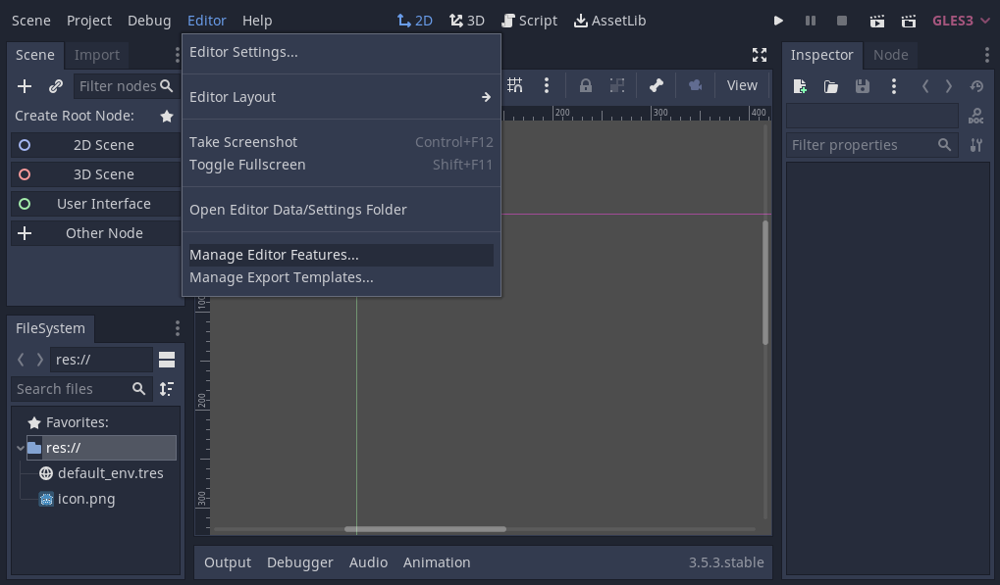
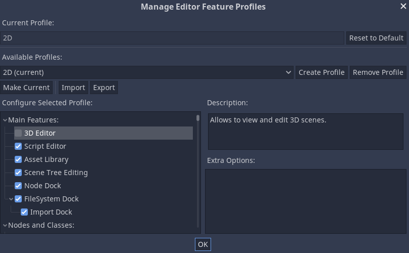
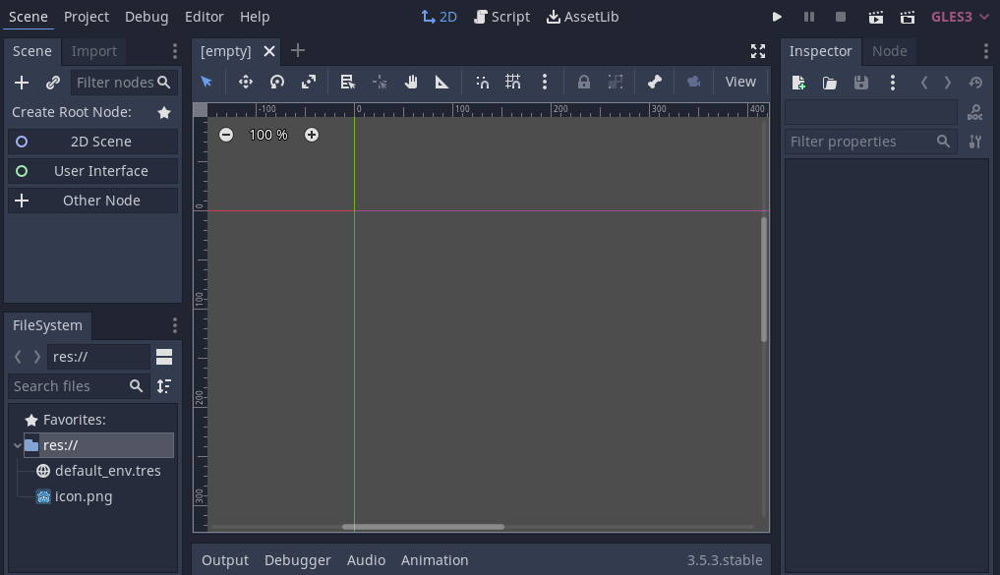
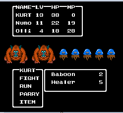

## Setting up the project

In this short first part, we'll set up and organize the project.

Download turnbased_game_2d_assets.zip. The archive contains a folder `Utility` with the scripts, images and font you'll be using to make the game. Extract the archive and move the art/ and fonts/ directories to your project's directory.

Launch Godot and create a new project.

When creating the new project, you only need to choose a valid Project Path. You can leave the other default settings alone.

* New Project - TurnBasedTutorial - Create Folder 
* Renderer: OpenGL ES 3.0
* Create & Edit

### Disable 3D in Editor

First we going to disable 3D in the editor. This is done in the `Editor > Manage Editor Features` menu.

Click New: "2D". Uncheck 3D Editor & Node & Classes > Nodes > Spatial. Click "Make Current" to enable the new profile. Exit with "OK". 

Now the 3D view is disabled in the editor.

## Preview the project

We are building a battle system similar to Dragon Quest 3. 