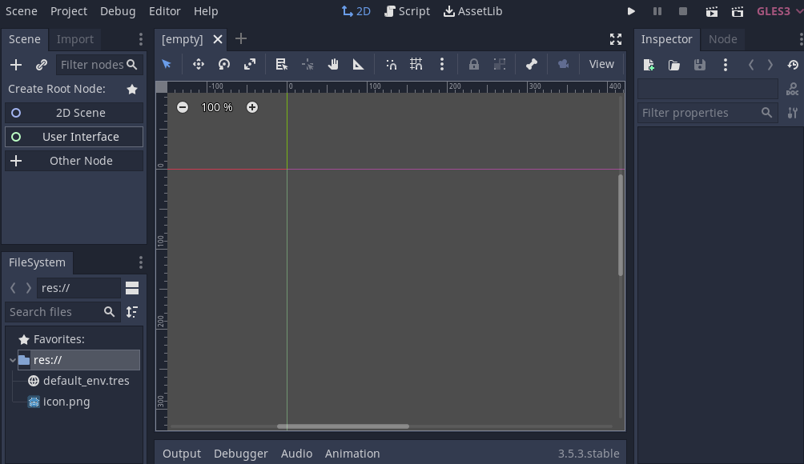
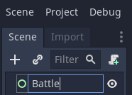
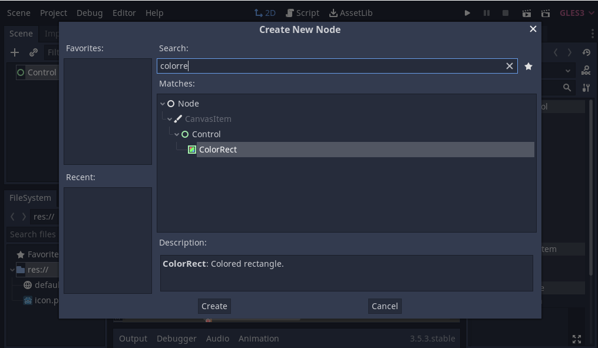
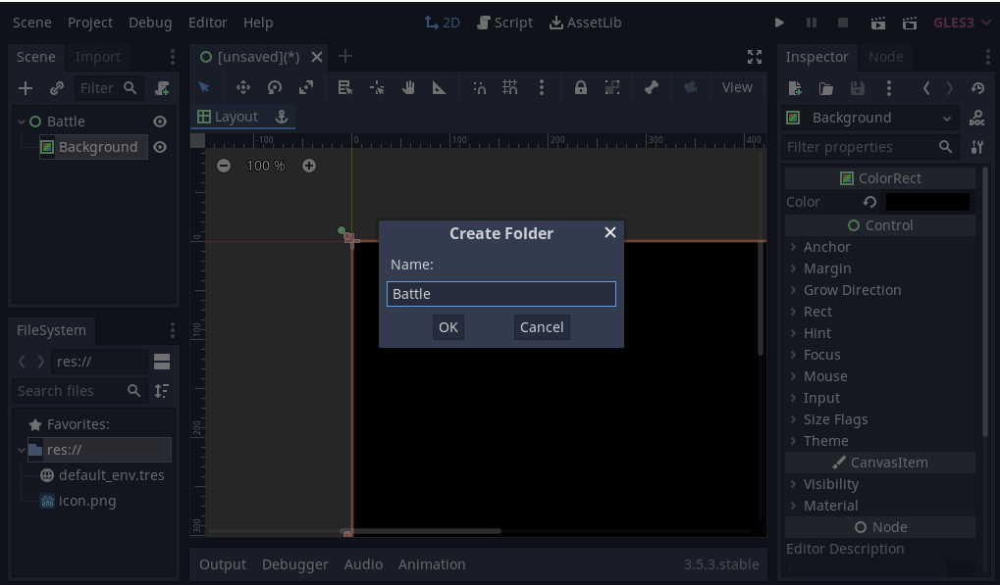
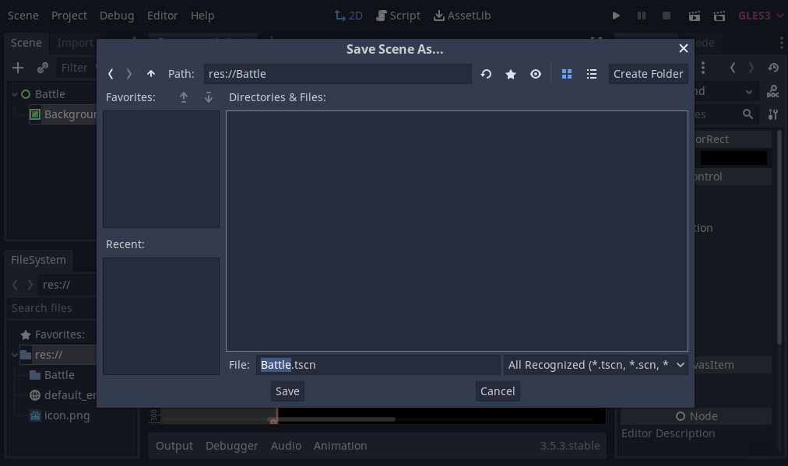

## Create Battle Background

As RPG are heavily UI based, we start with a Control Node. 
Click "User Interface". 

Rename Control to "Battle". 

To add a background node below Battle we click "+" symbol and type 
"colorrect".

Click ColorRect- in Inspector Color: (black - #000000)

Let ColorRect fill the whole scene. Select ColorRect, in middle of the screen click "Layout" and choose
"full rect". Finally rename ColorRect to "Background"

## Setup Folders and save first scene

In FileSystem - right-click on "res://" and select "New Folder". 
Name the folder "Battle".

To save the scene click `ctrl + s` and name the scene "Battle.tscn". We will save
it in the "Battle" folder. Click "Save".

