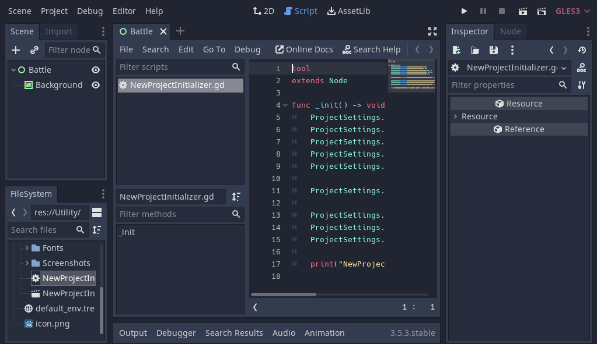

## Setup Project Initializer (Use Utlity Folder)

Let's add the Utility folder. Right-click on "res://" and select "Open in File Manager".


Unzip `turnbased_game_2d_assets.zip`. Move "Utility" folder from zip-file into the project folder.


We gonna run a script to set default settings in the project. Open "NewProjectInitializer.gd" 
in "Utility" folder. uncomment the tool at the top. click `ctrl + s` to Save.



Next open "NewProjectInitializer.tscn" in "Utility" folder. If you click on "Output"
at bottom you will see the text. 

> NewProjectInitalizer has completed. Comment out its "tool" line when done.

This means the script has setup default settings in the project. Close "NewProjectInitalizer.tscn"
with the "X" at top. 


Next, comment out the "tool" line in "NewProjectInitializer.gd" and save the file
with `ctrl + s`.


## Validate Script was run successfully

In NewProjectInitializer.gd on line 5 we have the text.

> ProjectSettings.set_setting("display/window/size/width", 320)

To validate the script. At top click Project - Project Settings.


Under Display - Window we can see that the width is set to 320. Meaning the script 
has run successfully.


## Manually changes in the Project Settings

With Autoload script we can handle the project when it starts.
```
F11: Toggle Fullscreen
P: Pause scene
Q: Quit
R: Reload scene
```
### Set Window setting

In Project Settings. Scroll down the settings to the bottom. set Strech mode to "viewport"
and Aspect to "keep". 


### Set Input Map setting - output button

Click tab "Input Map". in Action add "l3" and click "Add". 


### Set Autoload setting

Click tab "Autoloads". Click the "folder" icon. Locate "Utility/Autoloads" and 
select "Debug.gd". Then click "Add". 


Do same with "Globals.gd".


Finally, click "Close" twice to close the Project Settings.

....

## Run the project

Select "Battle" and in top right corner there's a ">" button. Click "Play" or F5.


A window popup to confirm Current. Make sure Battle was select as it will save 
as main scene. Click "Select Current".


A Black Screen should appear. To close it you can click "Q", added with Debug.gd, or 
the default commands "Stop" or F8. 


