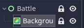

## Lock Scenes

Click "2D" in middle menu. Click "Battle" in middle menu select "Lock". This will lock the scene.
Do same for Background. Make sure to save `ctrl +s ` so the (*) goes way. 


There should be two locks next to the scene name.



## Add Script to Scene

Click "Battle" click on "Attach Script". 


A window appear "Create Script". Click "Create".


add first line in Battle.gd then save with `ctrl + s`.

```sh
class_name Battle extends Control
```

## Add a MarginContainer

Click "Battle". Click on "+". Type "MarginContainer". Click "Create".


## Add a Theme to the MarginContainer

Click "Battle". in Inspector - Click "Theme" - "New Theme". Click on "Theme" to open.


Click "Save as" and name it "battle_theme.tres". Click "Save". 


### Add MarginContainer to Theme

In Theme window next to Type: click on "+". Select MarginContainer and click "Add Type".
Then click the ".c" icon and click "+" to all four "margin_" variables.


### Add Font to Theme

Wide the Godot window larger to right. 
Click down arrow on Default Font. Click "New DynamicFont". 


A menu appear. Select "Font" and click "Font Data" then "Load. 


Select the dragon-warrior-1.tff file in "Utility/Fonts". Click "Open".


Finally click "Settings" and change Size to "8". 


### Customize MarginContainer

Select MarginContainer. In Middle Menu click "Layout - Full Rect".


### Validate MarginContainer in Theme

Click "MarginContainer. Click "+" add a ColorRect. The ColorRect should 
have black borders on all sides. This means the Margin in Theme is valid. 

