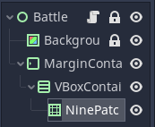
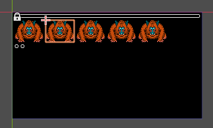

## Lock Scenes

Click "2D" in middle menu. Click "Battle" in middle menu select "Lock". This will lock the scene.
Do same for Background. Make sure to save `ctrl +s ` so the (*) goes way. 


There should be two locks next to the scene name.


## Add Script to Scene

Click "Battle" click on "Attach Script". 


A window appear "Create Script". Click "Create".


add first line in Battle.gd then save with `ctrl + s`.

```sh
class_name Battle extends Control
```

## Add Theme

Click "Battle". in Inspector - Click "Theme" - "New Theme". Click on "Theme" to open.


Click "Save as" and name it "battle_theme.tres". Click "Save". 


### Add MarginContainer to Theme

In Theme window next to Type: click on "+". Select MarginContainer and click "Add Type".
Then click the ".c" icon and click "+" to all four "margin_" variables.


### Add Font to Theme

Wide the Godot window larger to right. 
Click down arrow on Default Font. Click "New DynamicFont". 


A menu appear. Select "Font" and click "Font Data" then "Load. 


Select the dragon-warrior-1.tff file in "Utility/Fonts". Click "Open".


Finally click "Settings" and change Size to "8". 


## Add a MarginContainer

Click "Battle". Click on "+". Type "MarginContainer". Click "Create".


### Customize MarginContainer

Select MarginContainer. In Middle Menu click "Layout - Full Rect".


### Validate MarginContainer in Theme

Click "MarginContainer. Click "+" add a ColorRect. The ColorRect should 
have black borders on all sides. This means the Margin in Theme is valid. After validation
remove the ColorRect.


23:10

Click "MarginContainer. Click "+" add a VBoxContainer. Click VBoxContainer
Click "+" add a NinePatchRect. The Scene window should have two new items.



## Add Image to NinePatchRect

### Add Image & Folders in FileSystem

In FileSystem create a new folder "GUI" under res://. Create
a subfolder in GUI called "Art". Go into Utility/Arts and move ninepatch_clear.png to "GUI/Art".
Have this structure at end.


### Handle Import and Make Image NinePatch less blurry

Rightclick ninepatch_clear.png and select "Open". Inspector show
a blurry white ring. This is because of import settings. Click next
to "Scene" on "Import". Click on "Preset - 2D Pixel". Then click
"Preset - Set as 'Default' for Texture".


Click "Reimport" at bottom. The image in Inspector should 
change to show a pixel circle.


### Add NinePatchRect graphic

Click "Scene" at Top. Click "NinePatchRect". Click "+" add a NinePatchRect.
In Inspector add ninepatch_clear.png to Texture. Hold down left mouse button and drag image to Texture box,
or drag image to NinePatchRect, or click [empty] and select "Load" and find the image. 


## Customize NinePatchRect

Click NinePatchRect. In Inspector click Patch Margin. Add "3" to all fields.
The Layout should have a small white border around the black image. But not touching
the top or sides. 

import Image from '../../components/image'

<Image testImage="/images/04-battle-scene-03.png" testImageTwo="/images/04-battle-scene-04.png" />

## Add Scene Containers

Click VBoxContainer. Click "+" add a HBoxContainer. Leftclick twice on HBoxContainer and rename to "Enemies".


Duplicate Enemies with `ctrl + d` and rename to "Bottom". Click NinePatchRect and rename to
to "Top". Add two copies of Top to Bottom.


## Add Enemy Object

Click Enemies. Click "+" add a TextureButton. 
Rename TextureButton to EnemyButton.
In Filesystem. Click Battle and add another folder "Enemies".
Move `enemy_monkey.png` from Utility/Arts to "Enemies". In Windows select "Texture Normal". A Monkey
should appear in the black window.

<Image testImage="/images/04-battle-scene-07.png" testImageTwo="/images/04-battle-scene-08.png" />

## Add Script to EnemyButton

Click EnemyButton. Click "Attach Script". Select Template: Empty. Click Create. 
Add code below and save script.

```sh
class_name EnemyButton extends TextureButton
```

### Add EnemyButton as Scene

Rightclick EnemyButton. Click "Save Branch as Scene". Save EnemyButton.tscn to
Battle.


### Validate EnemyButton Scene

Click EnemyButton. Click "Open in Scene" icon. Click 2D at top.
Validate the Enemy sprite is visible. Close EnemyButton.


### Duplicate EnemyButton

Rightclick EnemyButton. Duplicate with `ctrl + d`. More
Monkey sprite should appear. Make 5 Monkeys.



## Center Enemies

Click Enemies. In Inspector click "Alignment: Center"

## Handle Top

Click Top. In Inspector (1) click "Size Flags" remove Fill in both fields.
Add "Shrink C". to Horizontal. (2) click "Rect" set min size to x: 180 y: 48.
Top should be in middle of window. 


## Handle Bottom - Tops Container

Click Bottom. In Inspector. Click "Alignment: Center". Rename Top2 to
Options & Top3 to EnemyInfo.


Click Options. In Inspector click "Rect". set min size to x: 60 y: 54.
Click EnemyInfo. In Inspector click "Rect". set min size to x: 96 y: 54.
Click VBoxContainer. In Inspector click "Theme Overrides - Constants" set Seperation: 8.
We should get this layout at end. 

