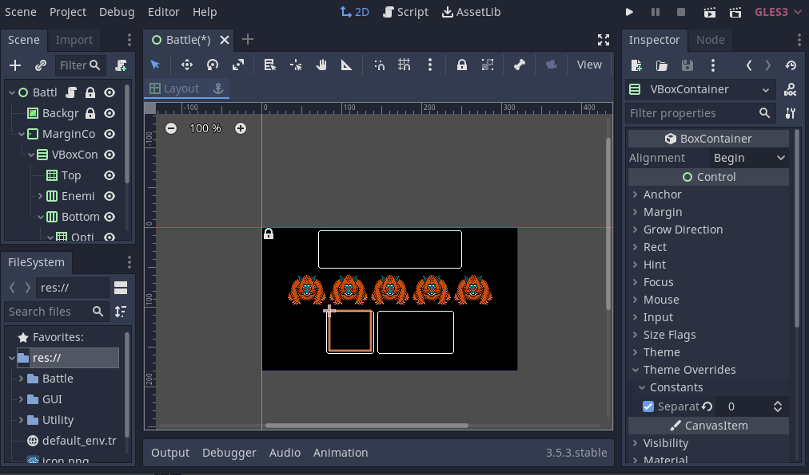
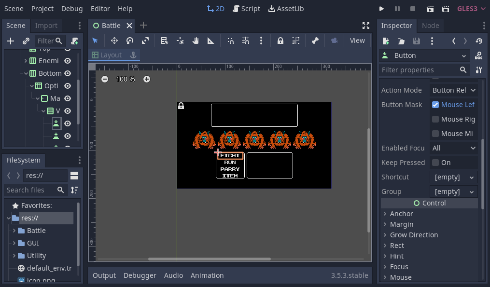
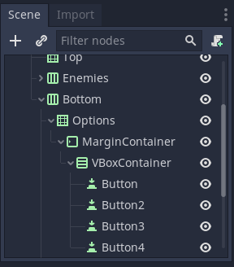
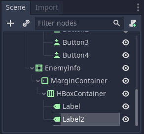
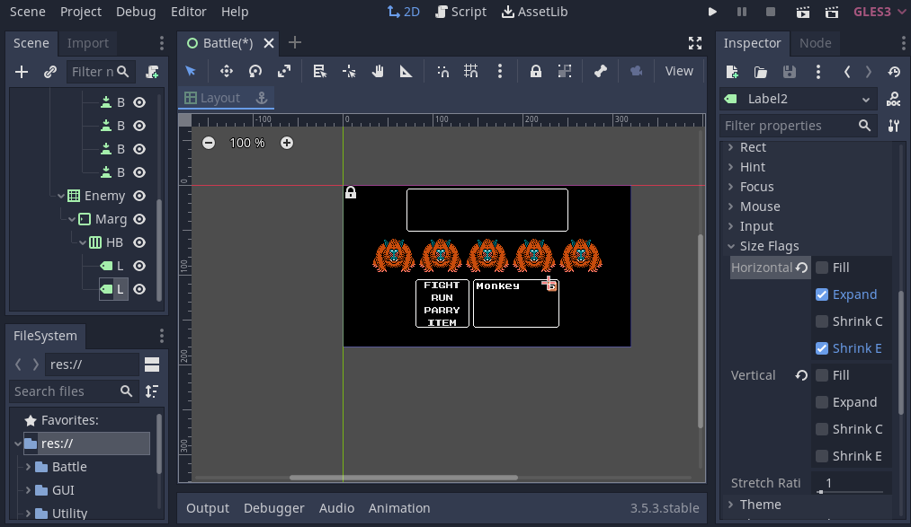
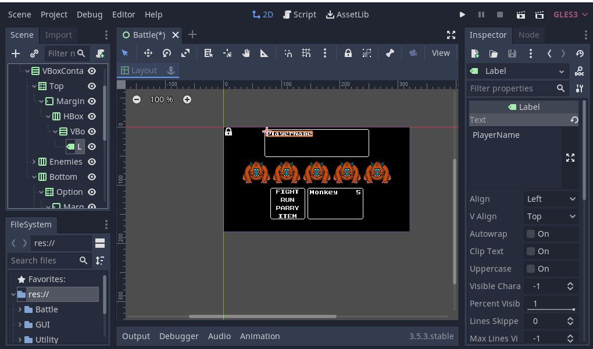
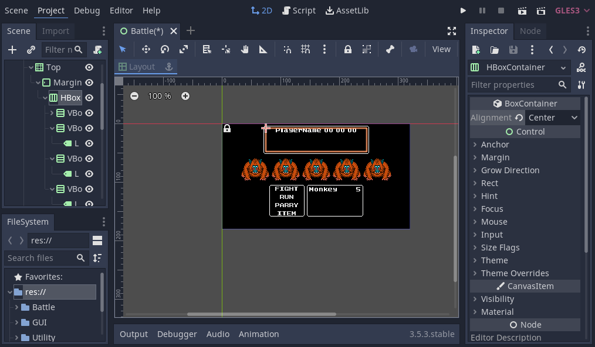
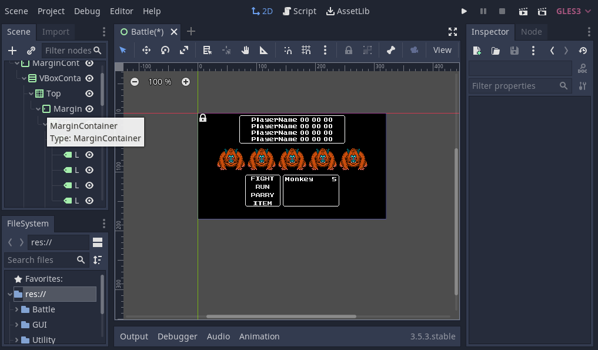
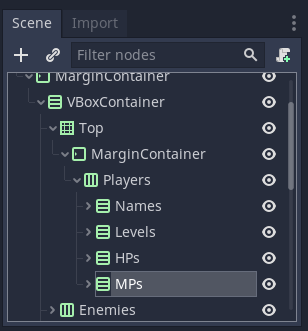

## Options

Click Options. Click "+" add a MarginContainer. In Middle Layout click "Full Rect".
In Inspector click "Theme Overrides - Constants" set Margin Top: 0. Click MarginContainer. Click "+" add a VBoxContainer. In Inspector click
"Theme Overrides - Constants" set Seperation: 0. It should look like this after

### Add Option Buttons

Click VBoxContainer. Click "+" add a VBoxContainer.
Click VBoxContainer. Click "+" add a Button. In Inspector click
Flat: On. Text: "FIGHT". Duplicate Button to get four buttons. In order
change text to "FIGHT", "RUN", "PARRY", "ITEM".

## EnemyInfo

Click EnemyInfo. Click "+" add a MarginContainer. In Middle Layout click "Full Rect".
Click MarginContainer. Click "+" add a HBoxContainer. Click HBoxContainer. 
Click "+" add a Label. Duplicate Label to get two labels.

### Customize labels

Click Label1. In Inspector type text: Monkey. Click Size Flags: Remove Fill and Shrink Center.
Click Label2. In Inspector type text: 5. In Inspector
click Size Flags: set Expand and Shrink End to horizontal, remove vertical.

## Top

Click Top. Click "+" add a MarginContainer. In Middle Layout click "Full Rect".

### Add HBoxContainer & VBoxContainers

Click MarginContainer. Click "+" add a HBoxContainer. 
Click HBoxContainer. Click "+" add a VBoxContainer.
Click VBoxContainer. In Inspector click Theme overrides - Constants: 3.
Click VBoxContainer. Click "+" add a Label. Click Label. In Inspector add text "PlayerName".

### Add Player statistics

Click VBoxContainer. Dupliate it once. Click second VBoxContainer.
In Inspector change text to 00. Duplicate second VBoxContainer two times
so we have three 00 container. Click on HBoxContainer below Top. 
in Inspector click Alignment: Center.

### Add Four Players

Click first VBoxContainer. Duplicate Label in it three times. 
Do same for all VBoxContainers.

### Rename Containers

Click HBoxContainer under Top. Rename to Players. Click VBoxContainer
rename in following order "Names", "Levels", "HPs", "MPs". 

