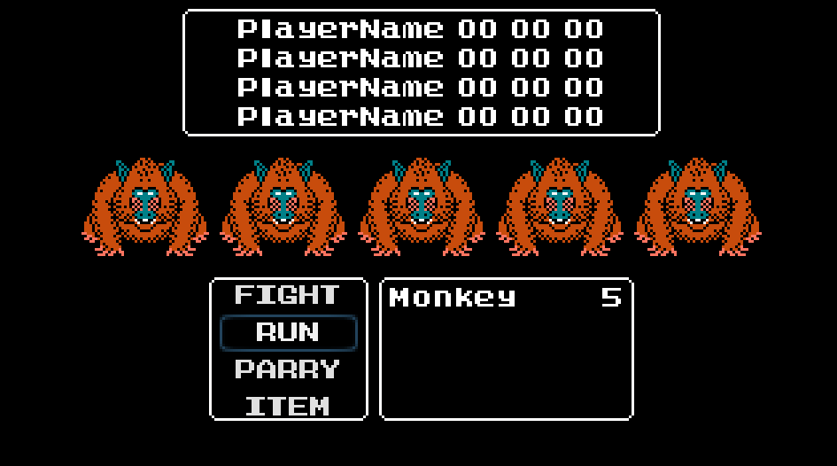

## Menus

### Add Movement on Options

Click Battle. Click "Open Script". 

```sh filename="Battle.gd"
class_name Battle extends Control

onready var options: Array = 

func _ready() -> void:
	pass
```

Drag Options - VBoxContainer to script under =.


```sh
onready var options: Array = $MarginContainer/VBoxContainer/Bottom/Options/MarginContainer/VBoxContainer
```

type after `VBoxContainer.get_children()`


Add under `_ready` this line. this focus on Options by default.

```sh {5-6} filename="Battle.gd" 
class_name Battle extends Control

onready var _options: Array = $MarginContainer/VBoxContainer/Bottom/Options/MarginContainer/VBoxContainer.get_children()

 func _ready() -> void:
    _options[0].grab_focus()
```

Click "RUN" at top-right corner. Move up and down with arrow keys.
to select different options. Exit with Q, F8 or Stop.



## Theme on Button

 Lets add Theme focus style on button to make it more visible. Click 
Battle. Click Theme `battle_theme.tres`. In Type click "+" add a Button. 

 

 Under "clr" icon click "+" on font_color_focus and set color to blue (#1d58a3). 
 Click "Save" to save Theme. Re-run app and see the color change. 

 

 ## Script to Options - Menu

 Click Options - VBoxContainer. Rename VBoxContainer to OptionsMenu.
Click "Attach Script".

 ```sh
 Inherits: Container
 Path: GUI/Menu.gd
 ```

```sh
class_name Menu extends Container
```

To add same functionality. But enable switch menu we add more code.


```py {3-16}  filename="Menu.gd"
class_name Menu extends Container

# index of button pressed
var index: int = 0

# get buttons
onready var _buttons: Array = get_children()

func connect_buttons_to_object(object: Object) -> void:
	print("Menu - name", name)
	for button in _buttons:
		button.connect("pressed", object, "_on_" + name + "_button_pressed", [button])

func button_focus(n: int = index) -> void:
	index = n
	_buttons[n].grab_focus()
```

```py {3-10} filename="Battle.gd"
class_name Battle extends Control

onready var _options_menu: Menu = $MarginContainer/VBoxContainer/Bottom/Options/MarginContainer/OptionsMenu

func _ready() -> void:
	_options_menu.connect_buttons_to_object(self)
	_options_menu.button_focus()

func _on_OptionsMenu_button_pressed(button: BaseButton) -> void:
	print(button.text)
	
```

Run the game. Should function same. Switch menu with down- and up arrow. Press
enter on a button should show it text in Output window. 

 

 ## Basic Battle Loop

In FileSystem. Drag GUI/Menu.gd to Enemies. Rename Enemies to EnemiesMenu.
Click Battle. Open Script. Add code below.

### Add Script to EnemiesMenu


```py {3} filename="Battle.gd"
class_name Battle extends Control

onready var _enemies_menu: Menu = 
onready var _options_menu: Menu = $MarginContainer/VBoxContainer/Bottom/Options/MarginContainer/OptionsMenu
...
```

Drag EnemiesMenu to script under =.

```py {3}
class_name Battle extends Control

onready var _enemies_menu: Menu = $MarginContainer/VBoxContainer/EnemiesMenu
onready var _options_menu: Menu = $MarginContainer/VBoxContainer/Bottom/Options/MarginContainer/OptionsMenu
...
```

### Function to Battle & Menu


```py {3, 7, 11-21} filename="Battle.gd"
class_name Battle extends Control

onready var _enemies_menu: Menu = $MarginContainer/VBoxContainer/EnemiesMenu
onready var _options_menu: Menu = $MarginContainer/VBoxContainer/Bottom/Options/MarginContainer/OptionsMenu

func _ready() -> void:
	_enemies_menu.connect_buttons_to_object(self)
	_options_menu.connect_buttons_to_object(self)
	_options_menu.button_focus()

func _on_OptionsMenu_button_pressed(button: BaseButton) -> void:
	match button.text:
		"FIGHT":
			print("Battle - Fight")
			_enemies_menu.button_focus()
		_:
			pass

func _on_EnemiesMenu_button_pressed(button: BaseButton) -> void:
	print("Battle - EnemiesMenu")
	button.hide()
```

```py {9-11, 18-23} filename="Menu.gd"
class_name Menu extends Container

# index of button pressed
var index: int = 0

# get buttons
onready var _buttons: Array = get_children()

func _ready() -> void:
	for button in _buttons:
		button.connect("focus_entered", self, "_on_button_focus_entered", [button])

func connect_buttons_to_object(object: Object) -> void:
	print("Menu - name", name)
	for button in _buttons:
		button.connect("pressed", object, "_on_" + name + "_button_pressed", [button])

func button_focus(n: int = index) -> void:
	index = clamp(n, 0, get_child_count())
	_buttons[n].grab_focus()

func on_button_focus_entered(button: BaseButton) -> void:
	index = button.get_index()
```

Run game. When click FIGHT. And Click a second time. One Monkey should disappear.

