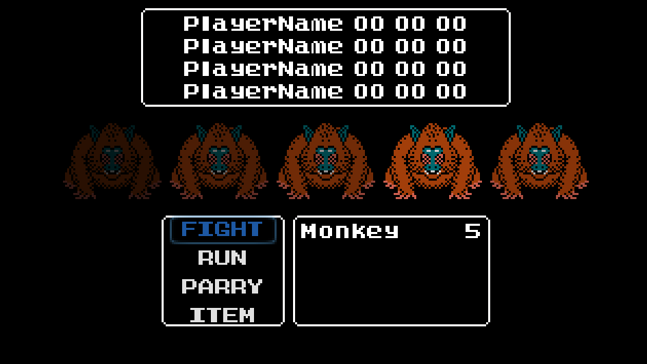
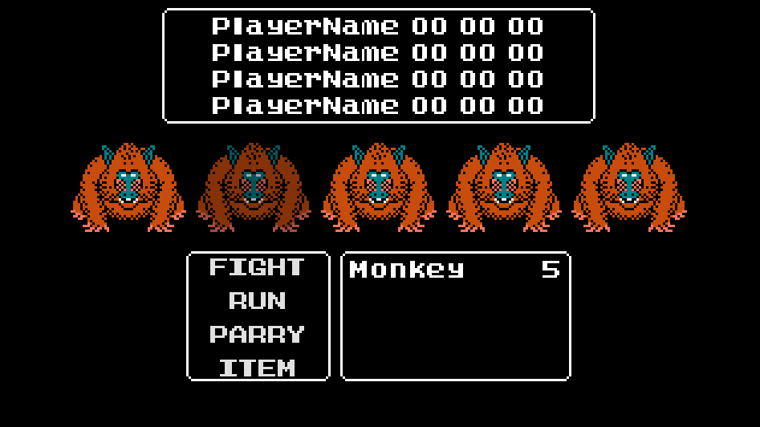

# Taking Damage & Hit Effects

## EnemyButton 

### Add Process Code

```py {9-11} filename="EnemyButton.gd"
class_name EnemyButton extends TextureButton

onready var _animation_player: AnimationPlayer = $AnimationPlayer

# default animation
func _ready() -> void:
	_animation_player.play("RESET")

# called every frame, (_ means not used)
func _process(_delta: float) -> void:
	self_modulate.a = randf()

func _on_EnemyButton_focus_entered():
	_animation_player.play("highlight")

func _on_EnemyButton_focus_exited():
	_animation_player.play("RESET")
```

### Add Timer

Click EnemyButton. Click "+" add Timer. Rename to Hit.
Click Hit. In Inspector set Wait Time: 0.5, One Shot to ON.


### Wait until Hit finish then turn of Hit Effect.

```py {3-6, 13-15, 23-29} filename="EnemyButton.gd"
class_name EnemyButton extends TextureButton

var hp_max: int = 1
var hp: int = hp_max

onready var _hit: Timer = $Hit
onready var _animation_player: AnimationPlayer = $AnimationPlayer

# default animation
func _ready() -> void:
	_animation_player.play("RESET")

# Hit effect - called every frame, (_ means not used)
func _process(_delta: float) -> void:
	self_modulate.a = randf()

func _on_EnemyButton_focus_entered():
	_animation_player.play("highlight")

func _on_EnemyButton_focus_exited():
	_animation_player.play("RESET")

func heal_hurt(value: int) -> void:
	hp = clamp(hp + value, 0, hp_max)
	if value < 0:
		set_process(true)
		_hit.start()
		yield(_hit, "timeout")
		set_process(false)
		self_modulate.a = 1.0
```

### Run game (has a bug)

Run game. The Monkey should be fade in and out quickly. Close Game.



### Fix the bug

Open "EnemyButton.gd"

```py {3} filename="EnemyButton.gd"
func _ready() -> void:
	_animation_player.play("RESET")
	set_process(false)
```

### Validate fix

Run Game again. The Monkey should not fade in and out.

## Battle Hit Script
```py {1,3} filename="Battle.gd"
func _on_EnemiesMenu_button_pressed(enemy_button: EnemyButton) -> void:
	print("Battle - EnemiesMenu")
	enemy_button.heal_hurt(-1)
```

### Run Game

Run Game. Click FIGHT. And Click a second time. 
One Monkey should be fade in and out quickly.



## Use Shader on Hit Effect

In FileSystem under Utility/Shaders. Drag `WhiteColor.tres` to
EnemyButton.

 

### Transparent EnemyButton sprite

Click EnemyButton. In FileSystem Utility/Arts move `enemy_monkey_transparent.png`
to folder Battle/Enemies. Drag `enemy_monkey_transparent.png` to EnemyButton. 
Select Texture Normal. A Transparent Monkey should appear in the black window.


Click EnemyButton. In Inspector at Material. WhiteColor.tres should be there.
Click on WhiteColor.tres to open menu. Shader Param set Active: On. The Monkey 
sprite should be white. Set Shader Param Active: Off.


### Create another AnimationPlayer

Click AnimationPlayer. In Lower menu click Animation - New. Name it "highlight_alt".
Click EnemyButton. In Lower Menu set Track to 0.


Click EnemyButton. In Inspector click "key" icon on Shader Param - Active. Click Create.


Click EnemyButton. In Lower Menu drag timeline to 0.2. Rightclick - Insert Key.
Click key at 0. In Inspector set value to On. Zoom Animation Track with `ctrl + wheel up`.


In AnimationTrack at "clock" icon change 1 to 0.4. 


### Change EnemyButton script

Open "EnemyButton.gd". Add code below.

```py {2} filename="EnemyButton.gd"
func _on_EnemyButton_focus_entered():
	_animation_player.play("highlight_alt")
```

Run Game. Click FIGHT. And Click a second time. 
The Monkey should be fade in and out white.

## Exit Focus on Enemy

### Code

Open "Battle.gd". Edit code below.

```py {4} filename="EnemyButton.gd"
func _on_EnemiesMenu_button_pressed(enemy_button: EnemyButton) -> void:
	print("Battle - EnemiesMenu")
	enemy_button.heal_hurt(-1)
	_options_menu.button_focus()
```

### Run

Run Game. Click FIGHT. And Click a second time. 
The Monkey should be fade in and out white. The focus should be on Options.