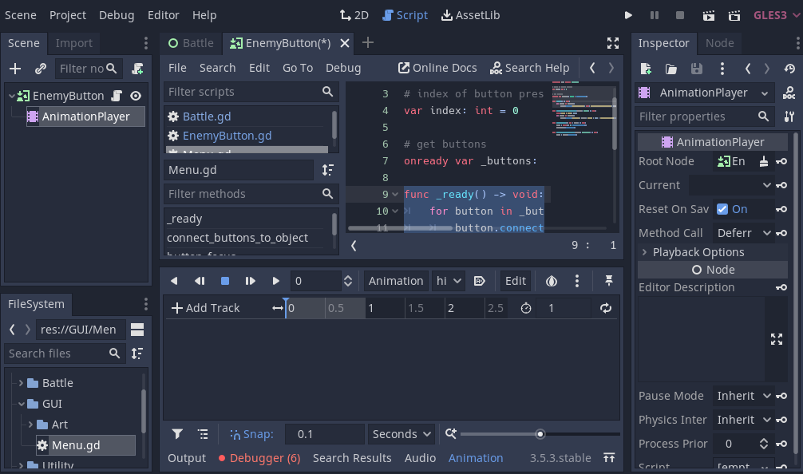

## Highlight to Enemy

### Animation to Enemy

Close Game. Click EnemyButton. Open Scene. Click "+" at Scene and add AnimationPlayer.


In Lower Menu click Animation - New. Name it "highlight". Click OK. A Track should appear.



Click EnemyButton. In Inspector click "Visibility". Click "key" icon on Self Modulate. In window Click Create.


In Lower Menu click on 0.5. Rightclick and Insert key. A new white dot appear.


Click 2D at top. Click the newly created white dot. In Inspector click "Value". Change A (Alpha) to 150. Click outside color window.
In Lower Menu click "loop" icon at right side. Click "Play" or `shift + d` to play animation. Monkey sprite should fade in and out. 
Click highlight in Lower Menu and select RESET.


### Code to Enemy

Click EnemyButton. Click "Open Script". Handle reset and play of animations. Add first part of Code below.

```py filename="EnemyButton.gd"
class_name EnemyButton extends TextureButton

onready var _animation_player: AnimationPlayer = $AnimationPlayer

# default animation
func _ready() -> void:
	print("what")
	_animation_player.play("RESET")
```

We will add a signal node. Click EnemyButton. In Node (next to Inspector) double-click focus_entered. Click Connect.


Do same for focus_exited. Add code below. There should also be a green arrow next to the functions.

```py filename="EnemyButton.gd"
...
func _on_EnemyButton_focus_entered():
	_animation_player.play("highlight")

func _on_EnemyButton_focus_exited():
	_animation_player.play("RESET")
```


### Run Game to confirm

Close EnemyButton. Click 2D at top. Click Run Game. Click Enter once. Then right and left arrow. Monkey should fade in and out.


