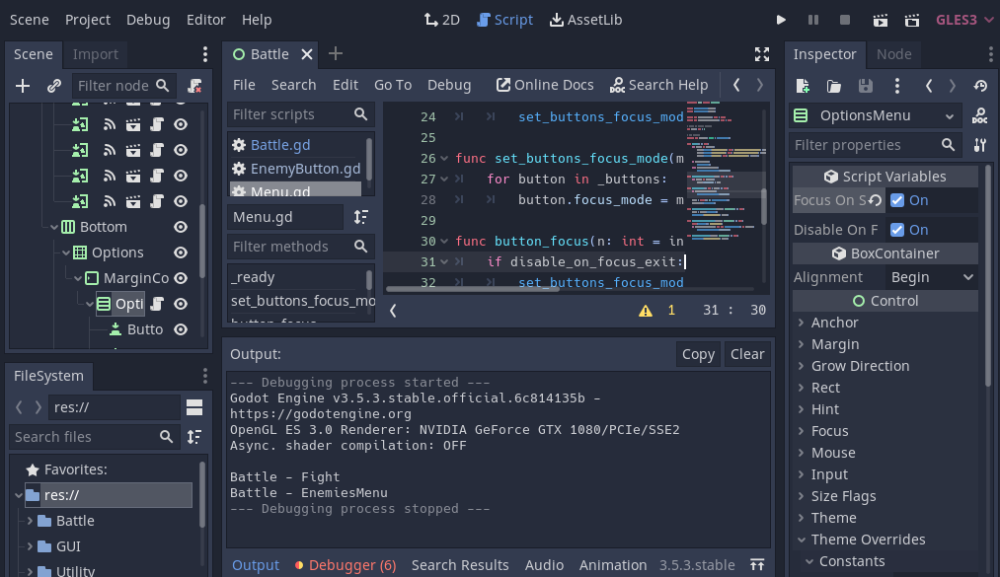

# Expanding Menu Functionality/Automation

## Add Code using Signals

### Battle code

```py {3} filename="Battle.gd"
class_name Battle extends Control

onready var _enemies_menu: Menu = $MarginContainer/VBoxContainer/EnemiesMenu
onready var _options_menu: Menu = $MarginContainer/VBoxContainer/Bottom/Options/MarginContainer/OptionsMenu

func _ready() -> void:
	_enemies_menu.connect("button_pressed", self, "_on_EnemiesMenu_button_pressed")
	_options_menu.connect("button_pressed", self, "_on_OptionsMenu_button_pressed")

func _on_OptionsMenu_button_pressed(button: BaseButton) -> void:
	match button.text:
		"FIGHT":
			print("Battle - Fight")
			_enemies_menu.button_focus()
		_:
			pass

func _on_EnemiesMenu_button_pressed(enemy_button: EnemyButton) -> void:
	print("Battle - EnemiesMenu")
	enemy_button.heal_hurt(-1)
	_options_menu.button_focus()

```

### Menu code

```py {3} filename="Menu.gd"
class_name Menu extends Container

signal button_focused(button)
signal button_pressed(button)

export var focus_on_start: bool = false
export var disable_on_focus_exit: bool = true

# index of button pressed
var index: int = 0

# get buttons
onready var _buttons: Array = get_children()

func _ready() -> void:
	for button in _buttons:
		button.connect("focus_entered", self, "_on_button_focus_entered", [button])
		button.connect("focus_exited", self, "_on_button_focus_exited", [button])
		button.connect("pressed", self, "_on_button_pressed", [button])
	
	if focus_on_start:
		button_focus()
	elif disable_on_focus_exit:
		set_buttons_focus_mode(FOCUS_NONE)

func set_buttons_focus_mode(mode: int) -> void:
	for button in _buttons:
		button.focus_mode = mode

func button_focus(n: int = index) -> void:
	if disable_on_focus_exit:
		set_buttons_focus_mode(FOCUS_ALL)
	
	index = clamp(n, 0, get_child_count())
	_buttons[n].grab_focus()
	
func _on_button_focus_entered(button: BaseButton) -> void:
	index = button.get_index()
	emit_signal("button_focused", button)

func _on_button_focus_exited(button: BaseButton) -> void:
	yield(get_tree(), "idle_frame")
	if disable_on_focus_exit and not get_focus_owner() in _buttons:
		set_buttons_focus_mode(FOCUS_NONE)

func _on_button_pressed(button: BaseButton) -> void:
	emit_signal("button_pressed", button)

```

### Edit Containers

Click OptionsMenu. In Inspector Script Variables Tab appear. 
Set Focus On Start to check.



### Run (same as before)

Run Game. Click FIGHT. And Click a second time. 
The Monkey should be fade in and out white. The focus should be on Options.

## Event Queue

Party actions & enemy actions are sorted by speed.
