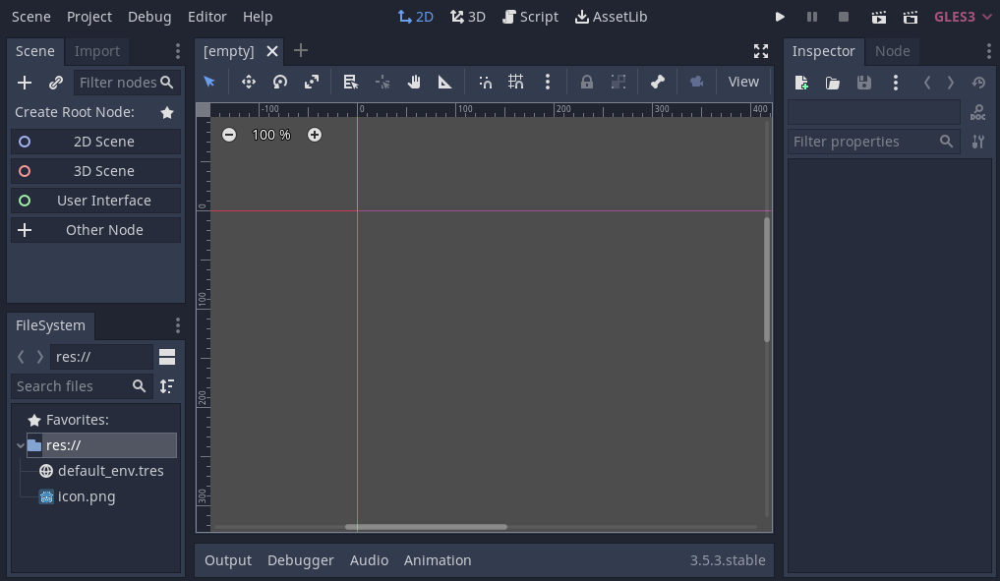
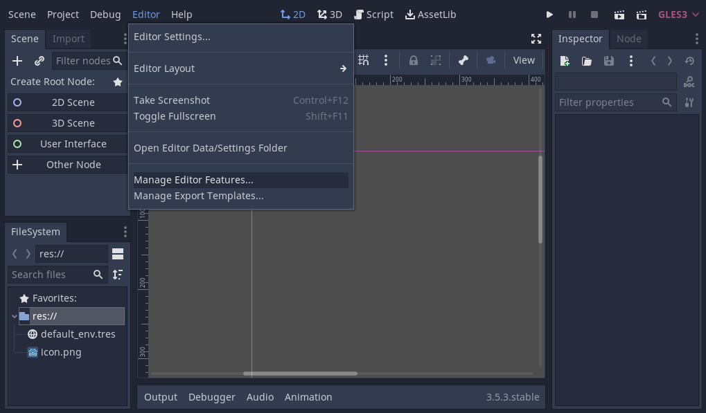
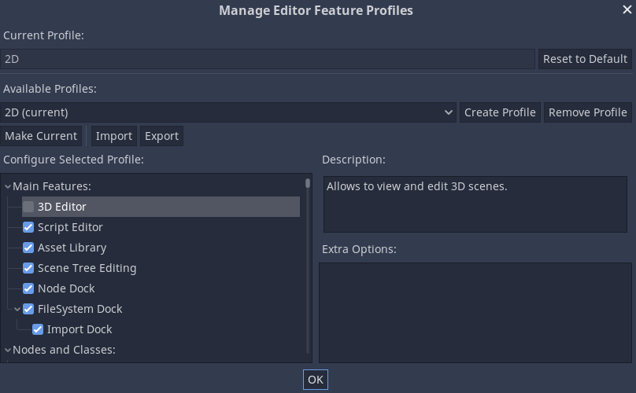
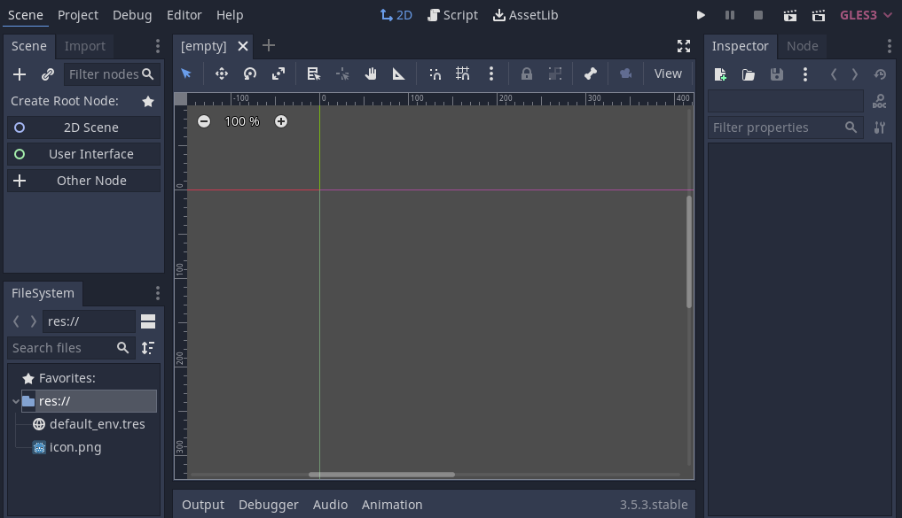
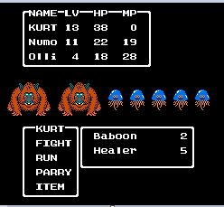
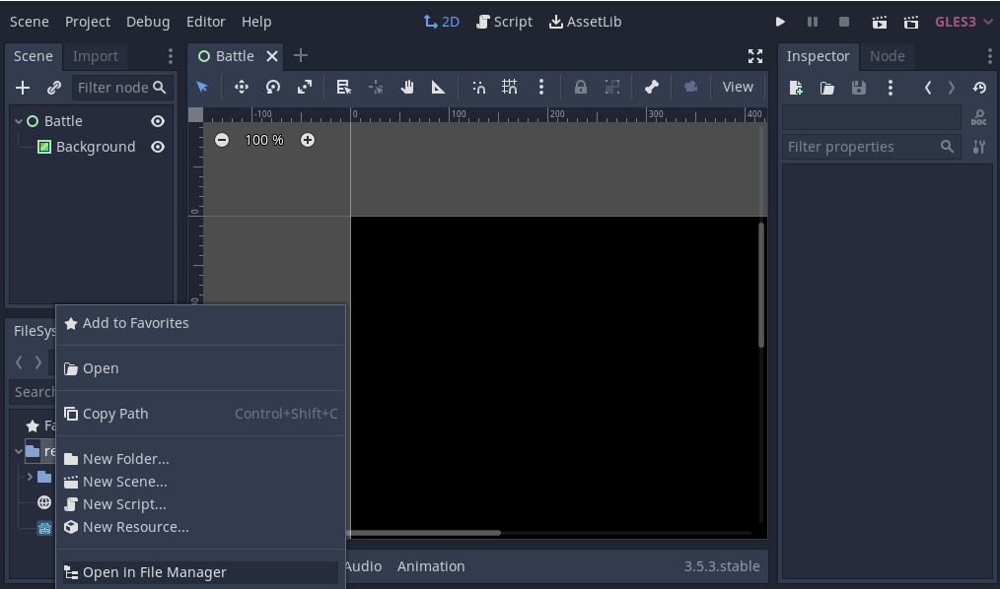
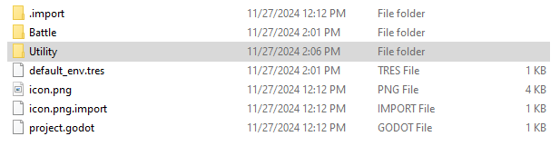
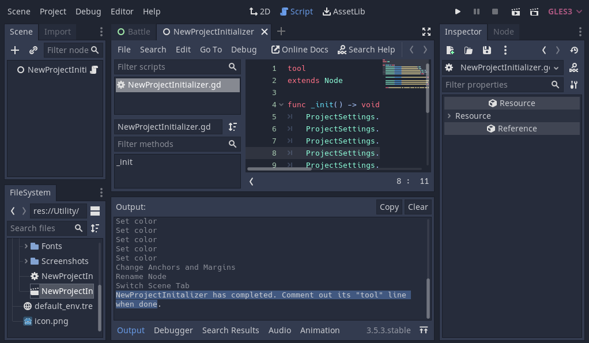

## Setting up the project

In this short first part, we'll set up and organize the project.

Download turnbased_game_2d_assets.zip. The archive contains a folder `Utility` with the scripts, images and font you'll be using to make the game. Extract the archive and move the art/ and fonts/ directories to your project's directory.


Launch Godot and create a new project.


When creating the new project, you only need to choose a valid Project Path. You can leave the other default settings alone.

* New Project - TurnBasedTutorial - Create Folder 
* Renderer: OpenGL ES 3.0
* Create & Edit



### Disable 3D in Editor

First we going to disable 3D in the editor. This is done in the `Editor > Manage Editor Features` menu.



Click New: "2D". Uncheck 3D Editor & Node & Classes > Nodes > Spatial. Click "Make Current" to enable the new profile. Exit with "OK". 




Now the 3D view is disabled in the editor.



## Preview the project




We are building a battle system similar to Dragon Quest 3. 

## Create Battle Background


As RPG are heavily UI based, we start with a Control Node. 
Click "User Interface". 

Rename Control to "Battle". 


To add a background node below Battle we click "+" symbol and type 
"colorrect".


Select ColorRect - in Inspector 
- color - (black - #000000)

Let ColorRect fill the whole scene. Select ColorRect, in middle of the screen click "Layout" and choose
"full rect". Finally rename ColorRect to "Background"


## Setup Folders and save first scene

In FileSystem - right-click on "res://" and select "New Folder". 
Name the folder "Battle".


To save the scene click `ctrl + s` and name the scene "Battle.tscn". We will save
it in the "Battle" folder. Click "Save".


### Setup Project Initializer (Use Utlity Folder)

Let's add the Utility folder. Right-click on "res://" and select "Open in File Manager". Name the folder "Utility".



Unzip `turnbased_game_2d_assets.zip`. Move "Utility" folder from zip-file into the project folder.



We gonna run a script to set default settings in the project. Open "NewProjectInitializer.gd" 
in "Utility" folder. uncomment the tool at the top. click `ctrl + s` to Save.


Next open "NewProjectInitializer.tscn" in "Utility" folder. If you click on "Output"
at bottom you will see the text. 

> NewProjectInitalizer has completed. Comment out its "tool" line when done.

This means the script has setup default settings in the project. Close "NewProjectInitalizer.tscn"
with the "X" at top. 



Next, comment out the "tool" line in "NewProjectInitializer.gd" and save the file
with `ctrl + s`.


### Validate Script was run successfully

In NewProjectInitializer.gd on line 5 we have the text.

> ProjectSettings.set_setting("display/window/size/width", 320)

To validate the script. At top click Project - Project Settings.


Under Display - Window we can see that the width is set to 320. Meaning the script 
has run successfully.


### Manually changes in the Project Settings

In Project Settings. Scroll down the settings to the bottom. set Strech mode to "viewport"
and Aspect to "keep". 


Project - Project Settings - 
- General - Windows (should update size,height)
- "stretch -  mode: viewpoint, aspect: keep"

input map - "l3" - add

This is the about page! This page is shown on the navbar.

Open Godot 3.5.3

```
Disable 3D in Editor
Editor > Manage Editor Features
Click New: "2D"
Uncheck 
Enabled Features > 3D Editor &
Enabled Classes > Nodes > Spatial
```

Click "Make Current" to enable the new profile

